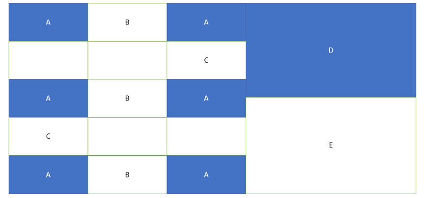
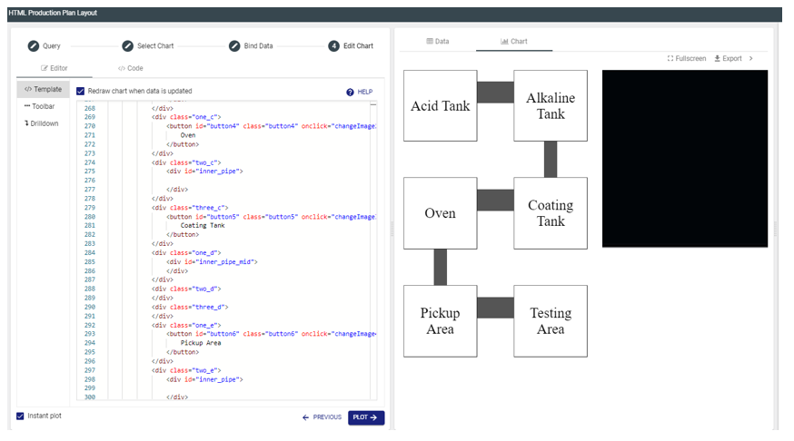
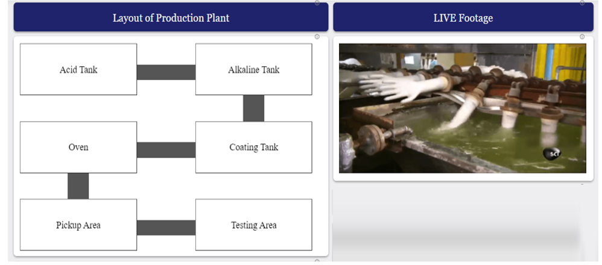

# Simulation-of-CCTV-Using-HTML
A html code to switch images to simulate the use of CCTV in a production plant

# Concept

A html chart using div will be created to replicate the layout of the production plant. This chart can switch between different footage of the 
production plant when the user selects any one of the buttons. By creating multiple div, we can manipulate the position of each individual div 
and arrange it according to the actual layout of a glove manufacturing plant. The code utilizes 17 div which has been classed as A, B, C, D, 
and E where A represents the buttons, B represents the vertical connector, C represents the horizontal connector, D represents the screen and 
E will represent the blank space to centralize div D. 

# Sample Output 1

# Sample Output 2

